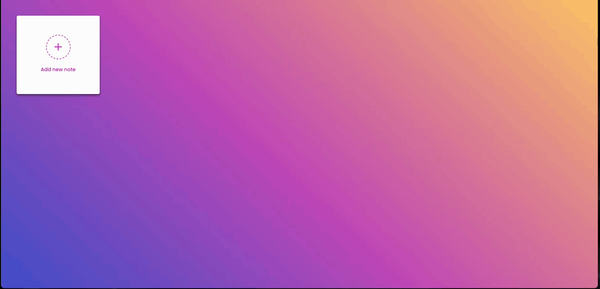

### 🚀 Project Features

### 🎥 Screenshots and GIFs

## Note Taking, Editing, and Deleting Feature in MOBILE:

# Add a screenshot or GIF of the homepage here:

# Note Taking and Management: Easily create, edit, and delete notes.

# Real-time Updates: Instantly updates without page reloads.

# User-friendly Interface: Simple and intuitive design.

# Responsive Design: Optimized for mobile, tablet, and desktop devices.

# Modern Animations: Smooth CSS animations and transitions.

## 📂 Project Structure

# index.html: Main page structure.

# styles.css: All styling and visual designs.

# script.js: Dynamic content and user interactions.

## 🛠️ Technologies Used

# HTML5

# CSS3 (Flexbox, Animations)

# Vanilla JavaScript
